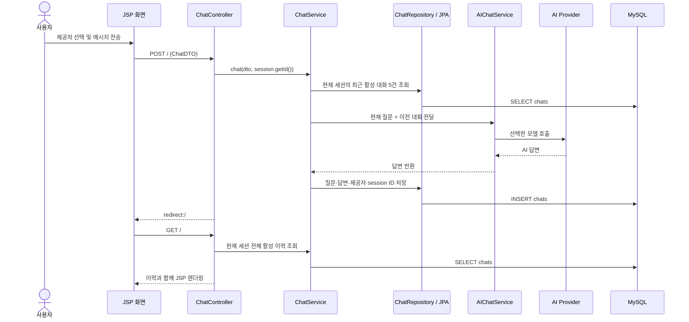
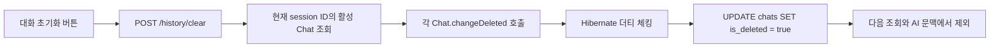

# FatDogAI2

> **Spring AI와 JPA를 함께 익히기 위해 만든 다중 AI 제공자 웹 채팅 애플리케이션**

사용자는 하나의 화면에서 Groq, Google Gemini, NVIDIA NIM 중 원하는 모델 제공자를 선택해 대화할 수 있습니다. 질문과 답변은 MySQL에 저장되며, 같은 브라우저 세션의 최근 대화를 다음 요청의 문맥으로 전달합니다. 대화 초기화는 실제 행을 지우지 않는 **소프트 딜리트(Soft Delete)** 방식으로 동작합니다.

## 목차

- [핵심 기능](#핵심-기능)
- [기술 스택](#기술-스택)
- [빠른 시작](#빠른-시작)
- [사용 방법](#사용-방법)
- [설계와 동작 흐름](#설계와-동작-흐름)
- [데이터베이스 설계](#데이터베이스-설계)
- [프로젝트 구조](#프로젝트-구조)
- [HTTP 엔드포인트](#http-엔드포인트)
- [검증 방법](#검증-방법)
- [제한 사항](#제한-사항)

## 핵심 기능

- **다중 AI 제공자 선택**: Groq, Google Gemini, NVIDIA NIM 중 하나를 선택해 같은 질문을 보낼 수 있습니다.
- **대화 이력 영속화**: 사용자 질문, AI 답변, 사용한 제공자, 생성 시각을 MySQL `chats` 테이블에 저장합니다.
- **세션별 대화 분리**: `HttpSession`의 ID를 `conversationId`로 사용해 브라우저 세션마다 대화 이력을 구분합니다.
- **최근 대화 문맥 유지**: 현재 세션의 활성 대화 최근 5건을 AI 프롬프트에 포함합니다.
- **소프트 딜리트 기반 초기화**: `대화 초기화`를 누르면 해당 세션의 대화만 `is_deleted = true`로 변경합니다. 데이터는 DB에 남지만 화면과 AI 문맥 조회에서는 제외됩니다.
- **JSP 채팅 화면**: 저장된 대화 이력을 다시 렌더링하고, AI 응답의 Markdown을 브라우저에서 표시합니다.

## 기술 스택

| 구분 | 사용 기술 | 용도 |
| --- | --- | --- |
| Language | Java 17 | 애플리케이션 개발 언어 |
| Framework | Spring Boot 4.1.0, Spring MVC | 웹 애플리케이션과 요청 처리 |
| AI | Spring AI 2.0.0 | Groq·Gemini·NIM 모델 호출 추상화 |
| Persistence | Spring Data JPA, Hibernate | 채팅 이력 저장, 조회, 더티 체킹 |
| Database | MySQL | 채팅 데이터 영속화 |
| View | JSP, JSTL, JavaScript | 채팅 UI 렌더링 |
| Build | Maven Wrapper | 의존성 관리 및 실행 |
| Deployment | Docker (멀티 스테이지 빌드) | 컨테이너 실행 |

## 빠른 시작

### 1. 준비물

- JDK 17
- MySQL 서버
- Groq, Google Gemini, NVIDIA NIM 중 **사용할 제공자**의 API 키
- macOS/Linux에서는 실행 권한이 있는 `mvnw` (Windows는 `mvnw.cmd` 사용)

### 2. MySQL 데이터베이스 생성

먼저 MySQL에 애플리케이션이 사용할 빈 데이터베이스를 만듭니다.

```sql
CREATE DATABASE fatdog
  CHARACTER SET utf8mb4
  COLLATE utf8mb4_unicode_ci;
```

`spring.jpa.hibernate.ddl-auto=update`가 설정되어 있으므로, 애플리케이션을 처음 실행하면 Hibernate가 `Chat` 엔티티를 기준으로 `chats` 테이블과 필요한 컬럼을 생성·보완합니다.

### 3. 환경 변수 파일 만들기

루트의 예시 파일을 복사해 `.env.dev`를 만들고, DB 정보와 API 키를 채웁니다.

```bash
cp .env.dev.example .env.dev
```

`.env.dev` 예시:

```properties
# MySQL 접속 정보
DB_HOST=localhost
DB_PORT=3306
DB_NAME=fatdog
DB_USER=your_db_user
DB_PASSWORD=your_db_password

# 사용할 AI 제공자의 키만 입력해도 됩니다.
GROQ_API_KEY=your_groq_api_key
GEMINI_API_KEY=your_gemini_api_key
NIM_API_KEY=your_nim_api_key
```

`.env.dev`는 `.gitignore`에 포함되어 있어 API 키가 Git에 올라가지 않습니다. 키가 비어 있는 제공자를 선택하면 해당 제공자의 인증 요청은 실패하므로, 화면에서 사용할 제공자의 키는 반드시 설정해야 합니다.

### 4. 실행

```bash
./mvnw spring-boot:run
```

Windows에서는 다음 명령을 사용합니다.

```bat
mvnw.cmd spring-boot:run
```

브라우저에서 [http://localhost:8080](http://localhost:8080)을 엽니다.

## 사용 방법

1. 화면의 드롭다운에서 `groq`, `google`, `nim` 중 하나를 선택합니다.
2. 메시지를 입력하고 `전송`을 누릅니다.
3. 질문과 응답이 화면에 표시되며, 하나의 `Chat` 레코드로 MySQL에 저장됩니다.
4. 이어서 질문하면 현재 브라우저 세션의 최근 대화 5건이 AI에 전달되어 이전 맥락을 참고할 수 있습니다.
5. `대화 초기화`를 누르면 현재 세션의 이력만 화면에서 사라집니다. 다른 세션의 이력과 DB 행은 삭제되지 않습니다.

### 문맥 유지 예시

```text
사용자: 내 이름은 철수야.
AI: 안녕하세요, 철수님!

사용자: 내 이름이 뭐야?
AI: 철수님입니다.
```

두 번째 요청을 보낼 때 서비스는 첫 번째 질문·답변을 함께 구성해 모델에 전달합니다. 문맥으로는 **최근 활성 대화 5건만** 사용합니다.

## 설계와 동작 흐름

### 일반 채팅 요청



### 대화 초기화와 소프트 딜리트



`clearChatHistory()`는 `@Transactional` 안에서 영속 상태의 엔티티 값을 바꿉니다. 별도의 `save()`나 `DELETE` 쿼리를 호출하지 않아도 트랜잭션이 끝날 때 Hibernate가 변경을 감지해 `UPDATE`를 실행합니다.

### AI 제공자 구성

| 화면 값 | 구성 방식 | 현재 설정 모델 |
| --- | --- | --- |
| `groq` | Groq의 OpenAI 호환 API를 `OpenAiChatModel`로 사용 | `openai/gpt-oss-120b` |
| `google` | Spring AI Google GenAI 스타터 사용 | `gemini-3.5-flash-lite` |
| `nim` | NVIDIA NIM의 OpenAI 호환 API를 별도 `ChatModel`로 구성 | `deepseek-ai/deepseek-v4-flash` |

모델명, 온도, 토큰 수, API 기본 URL은 `src/main/resources/application-dev.properties`에서 변경할 수 있습니다.

## 데이터베이스 설계

### `chats` 테이블

| 컬럼 | 타입/제약 | 설명 |
| --- | --- | --- |
| `id` | `BIGINT`, PK, Auto Increment | 채팅 식별자 |
| `question` | `TEXT` | 사용자 질문 |
| `answer` | `TEXT` | AI 답변 |
| `provider` | `VARCHAR` | 선택한 AI 제공자 (`groq`, `google`, `nim`) |
| `created_at` | `DATETIME` | `@PrePersist` 시점에 기록되는 생성 시각 |
| `conversation_id` | `VARCHAR(100)` | `HttpSession` ID 기반의 세션별 대화 식별자 |
| `is_deleted` | `BOOLEAN` | 소프트 딜리트 상태. `true`면 기본 조회에서 제외 |

현재 프로젝트에서는 Hibernate가 스키마를 관리합니다. `src/main/resources/sql/schema.sql`은 수동 스키마 관리가 필요할 때 참고할 수 있는 SQL입니다. Hibernate의 `ddl-auto=update`와 수동 DDL을 동시에 운영할 때는 실제 스키마를 먼저 확인해 중복·불일치가 없도록 관리해야 합니다.

저장된 데이터를 직접 확인하려면 다음 쿼리를 사용합니다.

```sql
SELECT id, question, answer, provider, conversation_id, created_at, is_deleted
FROM chats
ORDER BY created_at DESC;
```

## 프로젝트 구조

```text
src
├── main
│   ├── java/org/example/fatdogai2
│   │   ├── config
│   │   │   ├── ChatClientConfig.java    # 제공자별 ChatClient/ChatModel 빈 설정
│   │   │   └── JPAConfig.java
│   │   ├── controller
│   │   │   └── ChatController.java      # 화면 요청과 HttpSession 처리
│   │   ├── domain
│   │   │   ├── ModelProvider.java       # 화면에서 선택하는 제공자 enum
│   │   │   └── NimProperties.java       # NIM 설정 바인딩
│   │   ├── dto
│   │   │   └── ChatDTO.java             # 요청 메시지와 제공자 전달
│   │   ├── entity
│   │   │   ├── BaseEntity.java
│   │   │   └── Chat.java                # chats 테이블 엔티티, 소프트 딜리트 상태
│   │   ├── repository
│   │   │   ├── ChatRepository.java      # 서비스가 의존하는 저장소 인터페이스
│   │   │   ├── ChatRepositoryImpl.java  # JPA 구현 연결, 문맥 5건 제한
│   │   │   └── JPAChatRepository.java   # JPQL 기반 활성 대화 조회
│   │   └── service
│   │       ├── AIChatService.java       # 문맥 프롬프트 구성 및 모델 호출
│   │       └── ChatService.java         # 저장·조회·소프트 딜리트 트랜잭션
│   ├── resources
│   │   ├── application.properties        # 공통 웹 설정
│   │   ├── application-dev.properties    # DB·AI 개발 환경 설정
│   │   └── sql/schema.sql                # 수동 스키마 참고 SQL
│   └── webapp/WEB-INF/views
│       └── index.jsp                     # 채팅 UI
└── test
    └── java/org/example/fatdogai2
```

## HTTP 엔드포인트

| Method | Path | 설명 |
| --- | --- | --- |
| `GET` | `/` | 현재 `HttpSession`의 활성 대화를 조회해 채팅 화면을 렌더링합니다. |
| `POST` | `/` | `message`, `provider`를 받아 AI 응답을 생성하고 대화를 저장합니다. |
| `POST` | `/history/clear` | 현재 세션의 모든 활성 대화를 소프트 딜리트 처리합니다. |

`POST /` 요청의 폼 필드는 다음과 같습니다.

| 필드 | 예시 | 설명 |
| --- | --- | --- |
| `message` | `JPA의 더티 체킹을 설명해줘` | 사용자 질문 |
| `provider` | `groq` | `groq`, `google`, `nim` 중 하나 |

## Docker로 실행하기

```bash
docker build -t fatdog-ai2 .
docker run --env-file .env.dev -p 8080:8080 fatdog-ai2
```

컨테이너 안에서 `localhost`는 컨테이너 자신을 의미합니다. MySQL이 로컬 컴퓨터에서 실행 중이라면 Docker 환경에 맞는 DB 호스트 주소를 `DB_HOST`에 설정해야 합니다.

## 검증 방법

### 컴파일과 테스트

```bash
./mvnw -q -DskipTests compile
./mvnw test
```

### 수동 확인 시나리오

1. 서버를 실행하고 메시지를 하나 전송합니다.
2. MySQL에서 `chats`에 질문·답변·제공자·`conversation_id`가 저장됐는지 확인합니다.
3. 같은 브라우저에서 앞선 대화를 참조하는 후속 질문을 전송합니다.
4. `대화 초기화`를 누른 뒤 화면에서 기존 대화가 사라지는지 확인합니다.
5. DB에서 해당 행의 `is_deleted`가 `true`로 변경됐는지 확인합니다.

## 제한 사항

- 대화 구분 기준은 로그인 사용자 계정이 아니라 브라우저의 `HttpSession`입니다. 다른 브라우저·시크릿 창·새 세션은 별도 대화로 취급됩니다.
- AI에 전달하는 문맥은 최근 활성 대화 5건으로 제한됩니다. 전체 DB 기록을 모델에 전달하지는 않습니다.
- API 키는 서버 환경 변수로 관리해야 하며, 브라우저나 Git 저장소에 노출하면 안 됩니다.
- API 제공자의 모델명·요금·사용 가능 여부는 변경될 수 있으므로 실제 운영 전 각 제공자의 최신 정책을 확인해야 합니다.

## 참고

- [GitHub README 안내](https://docs.github.com/en/repositories/managing-your-repositorys-settings-and-features/customizing-your-repository/about-readmes): README에는 프로젝트의 목적, 시작 방법, 도움받는 방법처럼 저장소 방문자가 바로 알아야 할 정보를 둡니다.
- [Make a README](https://www.makeareadme.com/): 목적·설치·사용 방법을 중심으로 README를 구성하는 실용적인 템플릿입니다.
